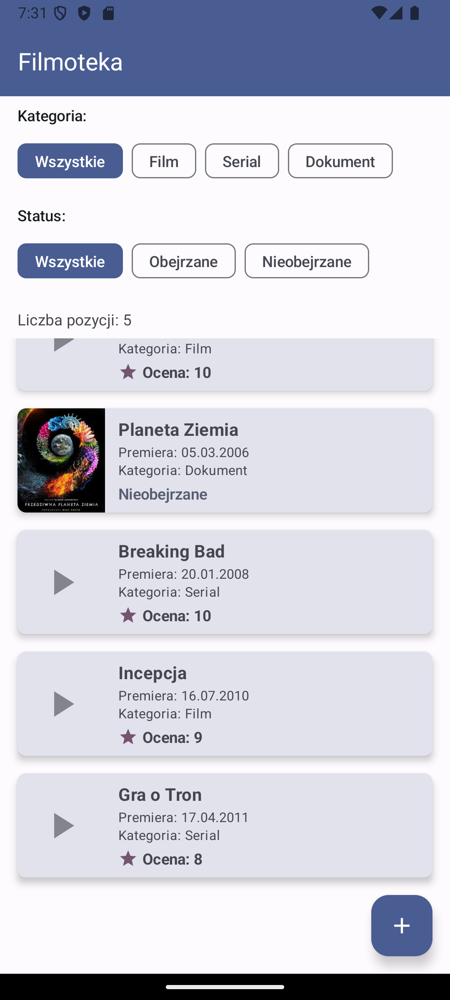
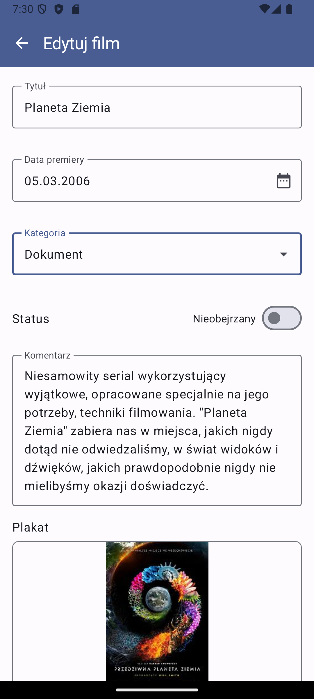
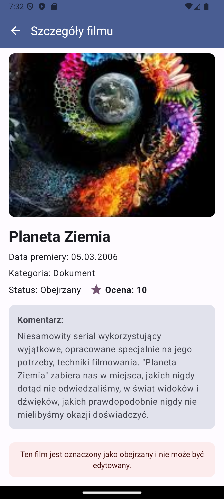
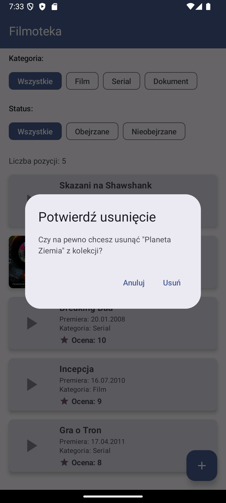

# 🎬 Filmoteka - Film Collection Manager

A native Android application for managing your personal movie collection. Built with Kotlin and Jetpack Compose, featuring a modern Material 3 design and local database storage using Room.


## 📋 Overview

Filmoteka is a comprehensive movie collection management app that helps users organize and track their film library. Whether you're a casual movie watcher or a serious film collector, this app provides all the tools you need to catalog films, TV series, and documentaries, track what you've watched, and rate your viewing experiences.

### 🌟 Key Features

- **Comprehensive Film Database** - Store detailed information about movies, series, and documentaries
- **Watch Status Tracking** - Mark films as watched or unwatched
- **Rating System** - Rate watched films on a scale of 1-10
- **Custom Categories** - Organize by Films, Series, or Documentaries
- **Gallery Integration** - Add movie posters from your device gallery
- **Advanced Filtering** - Filter by category and watch status
- **Automatic Sorting** - Films sorted by release date
- **Material You Design** - Modern Android design with dynamic theming

## 📱 Screenshots

<div align="center">

### Film List Screen

*Browse your collection with filtering options*

### Add/Edit Film Screen

*Add new films with detailed information*

### Film Details Screen

*View complete film information*

### Delete Confirmation

*Safe deletion with confirmation*

</div>

## 🏗️ Architecture

### Technology Stack

- **Language** - Kotlin 1.9.22
- **UI Framework** - Jetpack Compose with Material 3
- **Database** - Room 2.6.1
- **Navigation** - Navigation Compose 2.7.7
- **Image Loading** - Coil 2.5.0
- **Build System** - Gradle with KSP
- **Min SDK** - 24 (Android 7.0)
- **Target SDK** - 34 (Android 14)

### Project Structure

```
app/src/main/java/com/example/s24825/
├── data/                    # Data layer
│   ├── dao/                # Data Access Objects
│   │   └── FilmDao.kt
│   ├── database/           # Room database setup
│   │   └── FilmDatabase.kt
│   ├── entity/             # Database entities
│   │   └── Film.kt
│   └── repository/         # Repository pattern
│       └── FilmRepository.kt
├── ui/                     # Presentation layer
│   ├── main/              # Main activity
│   ├── list/              # Film list screen
│   ├── details/           # Film details screen
│   ├── addedit/           # Add/Edit screen
│   ├── components/        # Reusable UI components
│   └── theme/             # Material theme
├── util/                   # Utilities
│   ├── Converters.kt      # Room type converters
│   └── ImageUtils.kt      # Image handling
└── FilmotekaApplication.kt # Application class
```

### Architecture Pattern

The app follows **MVVM (Model-View-ViewModel)** architecture with Repository pattern:

- **Models** - Data classes and Room entities
- **Views** - Composable UI functions
- **ViewModels** - Business logic and state management
- **Repository** - Single source of truth for data

## 🚀 Getting Started

### Prerequisites

- Android Studio Hedgehog | 2023.1.1 or newer
- JDK 11 or higher
- Android SDK with API level 34
- Kotlin 1.9.22 compatible IDE

### Installation

1. Clone the repository:

```bash
git clone https://github.com/yourusername/filmoteka-android.git
cd filmoteka-android
```

2. Open the project in Android Studio

3. Sync the project with Gradle files

4. Run the app on an emulator or physical device

### Building the Project

```bash
# Debug build
./gradlew assembleDebug

# Release build
./gradlew assembleRelease

# Run tests
./gradlew test

# Install on connected device
./gradlew installDebug
```

## 📝 Features in Detail

### Film Management

- **Add New Films** - Comprehensive form with validation
- **Edit Film Details** - Modify unwatched films
- **Delete Films** - Long press with confirmation dialog
- **View Film Details** - Read-only view for watched films

### Data Fields

Each film entry contains:
- Title (required)
- Release date with DatePicker
- Category (Film/Series/Documentary)
- Watch status toggle
- Rating (1-10, for watched films)
- Comments/Review
- Poster image from gallery

### Filtering System

- Filter by category: All, Films, Series, Documents
- Filter by status: All, Watched, Unwatched
- Combined filters with item count display
- Persistent filter state during session

### Validation Rules

- Title cannot be empty
- Release date maximum 2 years in the future
- Rating required for watched films
- Category must be selected
- All validation errors displayed with helpful messages

## 🔧 Implementation Details

### Database Schema

```kotlin
@Entity(tableName = "films")
data class Film(
    @PrimaryKey(autoGenerate = true) val id: Long = 0,
    val title: String,
    val releaseDate: Date,
    val category: String,
    val isWatched: Boolean = false,
    val rating: Int? = null,
    val comment: String? = null,
    val posterPath: String? = null
)
```

### Navigation Flow

```
FilmListScreen
    ├── AddFilmScreen (FAB click)
    ├── EditFilmScreen (click unwatched)
    ├── FilmDetailsScreen (click watched)
    └── DeleteDialog (long press)
```

### State Management

- **StateFlow** for reactive UI updates
- **Coroutines** for asynchronous operations
- **Flow** for database observations
- **ViewModel** scoped state preservation

## 🎨 UI/UX Design

### Material 3 Components

- TopAppBar with primary color
- FloatingActionButton for adding films
- Cards with elevation and rounded corners
- FilterChips for category/status selection
- AlertDialogs for confirmations
- OutlinedTextFields with error states

### Custom Styling

- Film posters with 80dp width
- Rounded corners (8dp) throughout
- Consistent padding and spacing
- Status-based color coding
- Responsive layout for different screen sizes

## 📊 Performance Considerations

- **Image Loading** - Async loading with Coil and crossfade
- **Database Operations** - All operations on IO dispatcher
- **List Performance** - LazyColumn with stable keys
- **Memory Management** - Proper cleanup in ViewModels

## 🧪 Testing

The project includes sample data that loads on first launch:

- Inception (2010) - Watched, Rating: 9
- Game of Thrones (2011) - Watched, Rating: 8
- Planet Earth (2006) - Unwatched
- The Shawshank Redemption (1994) - Watched, Rating: 10
- Breaking Bad (2008) - Unwatched

## 📚 Dependencies

```kotlin
dependencies {
    // Compose BOM
    implementation(platform("androidx.compose:compose-bom:2023.10.01"))
    
    // Room Database
    implementation("androidx.room:room-runtime:2.6.1")
    implementation("androidx.room:room-ktx:2.6.1")
    ksp("androidx.room:room-compiler:2.6.1")
    
    // Navigation
    implementation("androidx.navigation:navigation-compose:2.7.7")
    
    // Image Loading
    implementation("io.coil-kt:coil-compose:2.5.0")
}
```

## 🤝 Contributing

This is an academic project developed for the Mobile Application Programming (PRM) course. While it's primarily for educational purposes, suggestions and feedback are welcome!

## 📄 License

This project is part of academic coursework and is subject to university guidelines regarding code sharing and collaboration.

## 👤 Author

**Krzysztof Przybysz**  
Student ID: s24825  
Course: Mobile Application Programming (PRM)  
Polish-Japanese Academy of Information Technology (PJATK)
